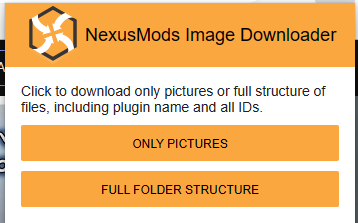

## NMID - Nexusmods Image Downloader
NMID is a Chrome extension that allows you to download images from the nexus mod page of the desired mod.

### Installation
Follow the steps below to install the extension:

- Download the [latest release](https://github.com/gkalian/nmid/releases).
- Unpack nmid.zip
- Open Google Chrome on your computer.
- Type "chrome://extensions/" in the address bar and press Enter.
- On the Extensions page, check the "Developer mode" checkbox in the top-right corner.
- Click the "Load unpacked" button and select the proper folder.
- The extension should now be installed and ready to use.

### Usage

- Clicking "Only pictures" will save the images to the `../NMID/` folder. 
- Clicking "Full folder structure" will save the images according to their respective game and mod name in the `../NMID/GAMENAME_ID/ID_MODNAME` folder structure.

### Credits
- NMID is a separate version/fork of the [nexus-mod-image-downloader](https://github.com/lazytwinkletoes/nexus-mod-image-downloader) with additional functionality and an extra button for downloading images. 
- The NexusMods icon used in the extension was sourced [from PngEgg](https://www.pngegg.com/en/png-ibdop).

### License
NMID is free to use and modify under any circumstances.